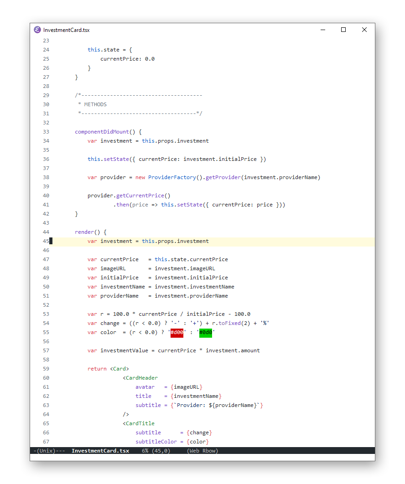

# GitHub Modern Theme for Emacs
This package provides a syntax highlighting theme for Emacs, inspired by the new GitHub theme colors. It attempts to stay true to the GitHub syntax highlighting colors, while still looking good in every language inside Emacs.

## Prerequisites
* [Emacs](https://www.gnu.org/software/emacs/) — An extensible, customizable, free/libre text editor — and more.

## Installation

The theme can either be installed manually by downloading the `github-modern-theme.el` file or through [MELPA](https://melpa.org/):

### MELPA

1. Make sure you have enabled MELPA in Emacs. *(Click [here](https://www.emacswiki.org/emacs/MELPA) for instructions.)*
2. Hit `M-x` in Emacs (usually, this means holding down the alt-key and pressing the x-key).
3. Type `package-install` and hit enter.
4. Type `github-modern-theme` and hit enter. The theme will now be downloaded and installed by Emacs.

## Usage

To enable the theme, Emacs must be instructed to load it:

1. Hit `M-x` again.
2. Type `load-theme` and hit enter. Emacs will now prompt you for the theme name.
4. Type `github-modern` and hit enter. The theme should now be applied.

If you want to apply the theme automatically when Emacs starts, make sure to add the following in your `init.el` file:

`(load-theme github-modern t)`

### Screenshot

